---
jupyter:
  colab:
  kernelspec:
    display_name: Python 3
    name: python3
  language_info:
    codemirror_mode:
      name: ipython
      version: 3
    file_extension: .py
    mimetype: text/x-python
    name: python
    nbconvert_exporter: python
    pygments_lexer: ipython3
    version: 3.12.5
  nbformat: 4
  nbformat_minor: 0
---

# Exploratory Data Analysis (EDA)

# 0. Import libraries and dataset {#0-import-libraries-and-dataset}

``` python
import numpy as np
import pandas as pd
import seaborn as sns
import matplotlib.pyplot as plt
import warnings
warnings.filterwarnings("ignore")
```

``` python
filepath = "./healthcare-dataset-stroke-data.csv"
stroke_data = pd.read_csv(filepath)
```
:::

# 1. Understanding Data Context {#1-understanding-data-context}
:::

## 1.1. Define problem {#11-define-problem}

According to the World Health Organization (WHO) stroke is the 2nd
leading cause of death globally, responsible for approximately 11% of
total deaths. This dataset is used to
`<span style="color: red;">`{=html}predict whether a patient is likely
to get stroke`</span>`{=html} based on the input parameters like gender,
age, various diseases, and smoking status. We will start with basic
exploratory data analysis
`<span style="color: yellow;">`{=html}(EDA)`</span>`{=html}, followed by
applying some `<span style="color: yellow;">`{=html}simple predictict
modelling`</span>`{=html}.

Please focus on understanding the high-level concepts first before
figuring out the details of the code (you will get used to the coding
part with practice).

-   Sections labeled **Exercises** are self-practice sections (with help
    from your trainer). You can use the results of these sections for
    your report.
-   Similarly, there are suggestive questions throughout the report that
    might take deeper investigation and thought. Your answers would be
    useful for both your reports and future job interviews

``` python
# Print the DataFrame
stroke_data
```

```{=html}
<div>
<style scoped>
    .dataframe tbody tr th:only-of-type {
        vertical-align: middle;
    }

    .dataframe tbody tr th {
        vertical-align: top;
    }

    .dataframe thead th {
        text-align: right;
    }
</style>
<table border="1" class="dataframe">
  <thead>
    <tr style="text-align: right;">
      <th></th>
      <th>id</th>
      <th>gender</th>
      <th>age</th>
      <th>hypertension</th>
      <th>heart_disease</th>
      <th>ever_married</th>
      <th>work_type</th>
      <th>Residence_type</th>
      <th>avg_glucose_level</th>
      <th>bmi</th>
      <th>smoking_status</th>
      <th>stroke</th>
    </tr>
  </thead>
  <tbody>
    <tr>
      <th>0</th>
      <td>9046</td>
      <td>Male</td>
      <td>67.0</td>
      <td>0</td>
      <td>1</td>
      <td>Yes</td>
      <td>Private</td>
      <td>Urban</td>
      <td>228.69</td>
      <td>36.6</td>
      <td>formerly smoked</td>
      <td>1</td>
    </tr>
    <tr>
      <th>1</th>
      <td>51676</td>
      <td>Female</td>
      <td>61.0</td>
      <td>0</td>
      <td>0</td>
      <td>Yes</td>
      <td>Self-employed</td>
      <td>Rural</td>
      <td>202.21</td>
      <td>NaN</td>
      <td>never smoked</td>
      <td>1</td>
    </tr>
    <tr>
      <th>2</th>
      <td>31112</td>
      <td>Male</td>
      <td>80.0</td>
      <td>0</td>
      <td>1</td>
      <td>Yes</td>
      <td>Private</td>
      <td>Rural</td>
      <td>105.92</td>
      <td>32.5</td>
      <td>never smoked</td>
      <td>1</td>
    </tr>
    <tr>
      <th>3</th>
      <td>60182</td>
      <td>Female</td>
      <td>49.0</td>
      <td>0</td>
      <td>0</td>
      <td>Yes</td>
      <td>Private</td>
      <td>Urban</td>
      <td>171.23</td>
      <td>34.4</td>
      <td>smokes</td>
      <td>1</td>
    </tr>
    <tr>
      <th>4</th>
      <td>1665</td>
      <td>Female</td>
      <td>79.0</td>
      <td>1</td>
      <td>0</td>
      <td>Yes</td>
      <td>Self-employed</td>
      <td>Rural</td>
      <td>174.12</td>
      <td>24.0</td>
      <td>never smoked</td>
      <td>1</td>
    </tr>
    <tr>
      <th>...</th>
      <td>...</td>
      <td>...</td>
      <td>...</td>
      <td>...</td>
      <td>...</td>
      <td>...</td>
      <td>...</td>
      <td>...</td>
      <td>...</td>
      <td>...</td>
      <td>...</td>
      <td>...</td>
    </tr>
    <tr>
      <th>5105</th>
      <td>18234</td>
      <td>Female</td>
      <td>80.0</td>
      <td>1</td>
      <td>0</td>
      <td>Yes</td>
      <td>Private</td>
      <td>Urban</td>
      <td>83.75</td>
      <td>NaN</td>
      <td>never smoked</td>
      <td>0</td>
    </tr>
    <tr>
      <th>5106</th>
      <td>44873</td>
      <td>Female</td>
      <td>81.0</td>
      <td>0</td>
      <td>0</td>
      <td>Yes</td>
      <td>Self-employed</td>
      <td>Urban</td>
      <td>125.20</td>
      <td>40.0</td>
      <td>never smoked</td>
      <td>0</td>
    </tr>
    <tr>
      <th>5107</th>
      <td>19723</td>
      <td>Female</td>
      <td>35.0</td>
      <td>0</td>
      <td>0</td>
      <td>Yes</td>
      <td>Self-employed</td>
      <td>Rural</td>
      <td>82.99</td>
      <td>30.6</td>
      <td>never smoked</td>
      <td>0</td>
    </tr>
    <tr>
      <th>5108</th>
      <td>37544</td>
      <td>Male</td>
      <td>51.0</td>
      <td>0</td>
      <td>0</td>
      <td>Yes</td>
      <td>Private</td>
      <td>Rural</td>
      <td>166.29</td>
      <td>25.6</td>
      <td>formerly smoked</td>
      <td>0</td>
    </tr>
    <tr>
      <th>5109</th>
      <td>44679</td>
      <td>Female</td>
      <td>44.0</td>
      <td>0</td>
      <td>0</td>
      <td>Yes</td>
      <td>Govt_job</td>
      <td>Urban</td>
      <td>85.28</td>
      <td>26.2</td>
      <td>Unknown</td>
      <td>0</td>
    </tr>
  </tbody>
</table>
<p>5110 rows × 12 columns</p>
</div>
```
:::
:::

::: {.cell .markdown}
## 1.2. Describe the dataset {#12-describe-the-dataset}
:::

### 1.2.1 Properties of the dataset {#121-properties-of-the-dataset}

-   info, shape, columns, describe

``` python
stroke_data.info()
```

::: {.output .stream .stdout}
    <class 'pandas.core.frame.DataFrame'>
    RangeIndex: 5110 entries, 0 to 5109
    Data columns (total 12 columns):
     #   Column             Non-Null Count  Dtype  
    ---  ------             --------------  -----  
     0   id                 5110 non-null   int64  
     1   gender             5110 non-null   object 
     2   age                5110 non-null   float64
     3   hypertension       5110 non-null   int64  
     4   heart_disease      5110 non-null   int64  
     5   ever_married       5110 non-null   object 
     6   work_type          5110 non-null   object 
     7   Residence_type     5110 non-null   object 
     8   avg_glucose_level  5110 non-null   float64
     9   bmi                4909 non-null   float64
     10  smoking_status     5110 non-null   object 
     11  stroke             5110 non-null   int64  
    dtypes: float64(3), int64(4), object(5)
    memory usage: 479.2+ KB
:::
:::

``` python
stroke_data.columns
```

::: {.output .execute_result execution_count="5"}
    Index(['id', 'gender', 'age', 'hypertension', 'heart_disease', 'ever_married',
           'work_type', 'Residence_type', 'avg_glucose_level', 'bmi',
           'smoking_status', 'stroke'],
          dtype='object')
:::
:::

``` python
stroke_data.shape
```

::: {.output .execute_result execution_count="6"}
    (5110, 12)
:::
:::

``` python
stroke_data.describe()
```

```{=html}
<div>
<style scoped>
    .dataframe tbody tr th:only-of-type {
        vertical-align: middle;
    }

    .dataframe tbody tr th {
        vertical-align: top;
    }

    .dataframe thead th {
        text-align: right;
    }
</style>
<table border="1" class="dataframe">
  <thead>
    <tr style="text-align: right;">
      <th></th>
      <th>id</th>
      <th>age</th>
      <th>hypertension</th>
      <th>heart_disease</th>
      <th>avg_glucose_level</th>
      <th>bmi</th>
      <th>stroke</th>
    </tr>
  </thead>
  <tbody>
    <tr>
      <th>count</th>
      <td>5110.000000</td>
      <td>5110.000000</td>
      <td>5110.000000</td>
      <td>5110.000000</td>
      <td>5110.000000</td>
      <td>4909.000000</td>
      <td>5110.000000</td>
    </tr>
    <tr>
      <th>mean</th>
      <td>36517.829354</td>
      <td>43.226614</td>
      <td>0.097456</td>
      <td>0.054012</td>
      <td>106.147677</td>
      <td>28.893237</td>
      <td>0.048728</td>
    </tr>
    <tr>
      <th>std</th>
      <td>21161.721625</td>
      <td>22.612647</td>
      <td>0.296607</td>
      <td>0.226063</td>
      <td>45.283560</td>
      <td>7.854067</td>
      <td>0.215320</td>
    </tr>
    <tr>
      <th>min</th>
      <td>67.000000</td>
      <td>0.080000</td>
      <td>0.000000</td>
      <td>0.000000</td>
      <td>55.120000</td>
      <td>10.300000</td>
      <td>0.000000</td>
    </tr>
    <tr>
      <th>25%</th>
      <td>17741.250000</td>
      <td>25.000000</td>
      <td>0.000000</td>
      <td>0.000000</td>
      <td>77.245000</td>
      <td>23.500000</td>
      <td>0.000000</td>
    </tr>
    <tr>
      <th>50%</th>
      <td>36932.000000</td>
      <td>45.000000</td>
      <td>0.000000</td>
      <td>0.000000</td>
      <td>91.885000</td>
      <td>28.100000</td>
      <td>0.000000</td>
    </tr>
    <tr>
      <th>75%</th>
      <td>54682.000000</td>
      <td>61.000000</td>
      <td>0.000000</td>
      <td>0.000000</td>
      <td>114.090000</td>
      <td>33.100000</td>
      <td>0.000000</td>
    </tr>
    <tr>
      <th>max</th>
      <td>72940.000000</td>
      <td>82.000000</td>
      <td>1.000000</td>
      <td>1.000000</td>
      <td>271.740000</td>
      <td>97.600000</td>
      <td>1.000000</td>
    </tr>
  </tbody>
</table>
</div>
```
:::
:::

``` python
stroke_counts = stroke_data['stroke'].value_counts()
stroke_counts
```

::: {.output .execute_result execution_count="8"}
    stroke
    0    4861
    1     249
    Name: count, dtype: int64
:::
:::

``` python
stroke_percentages = stroke_data['stroke'].value_counts(normalize=True) * 100
stroke_percentages
```

::: {.output .execute_result execution_count="9"}
    stroke
    0    95.127202
    1     4.872798
    Name: proportion, dtype: float64
:::
:::

::: {.cell .markdown}
### Addition
:::

::: {.cell .code execution_count="10"}
``` python
# Check for Imbalance
stroke_counts.plot(kind='bar', color=['skyblue', 'orange'])
plt.title('Stroke Column Value Counts')
plt.xlabel('Stroke (0 = No, 1 = Yes)')
plt.ylabel('Count')
plt.xticks(rotation=0)
plt.show()
```

::: {.output .display_data}
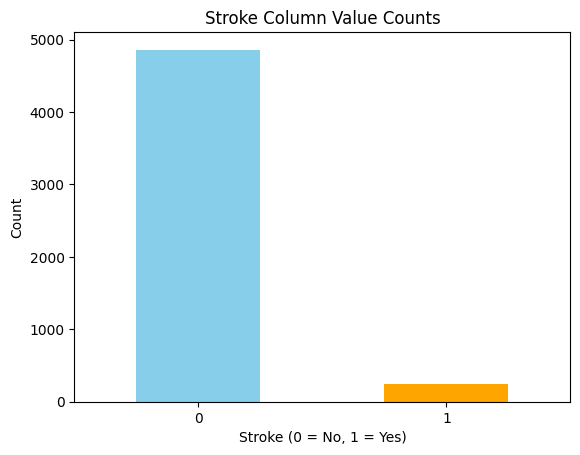

### 1.1.2. The meaning of columns {#112-the-meaning-of-columns}

Each row in the data provides relavant information about the patient.

1.  id: unique identifier
2.  gender: \"Male\", \"Female\" or \"Other\"
3.  age: age of the patient
4.  hypertension: 0 if the patient doesn\'t have hypertension, 1 if the
    patient has hypertension
5.  heart_disease: 0 if the patient doesn\'t have any heart diseases, 1
    if the patient has a heart disease
6.  ever_married: \"No\" or \"Yes\"
7.  work_type: \"children\", \"Govt_job\", \"Never_worked\", \"Private\"
    or \"Self-employed\"
8.  Residence_type: \"Rural\" or \"Urban\"
9.  avg_glucose_level: average glucose level in blood
10. bmi: body mass index
11. smoking_status: \"formerly smoked\", \"never smoked\", \"smokes\" or
    \"Unknown\"\*
12. stroke: 1 if the patient had a stroke or 0 if not

-   Note: \"Unknown\" in smoking_status means that the information is
    unavailable for this patient
:::

## 1.3. Exercises {#13-exercises}
:::

`<span style="color: yellow; font-weight: bold;">`{=html}Exercises:`</span>`{=html}

-   1.  Which columns are numerical and which ones are categorical?

-   1.  Why is it important to analyze numerical and non-numerical
        columns separately?

### 1.3.1. Exercise 1 {#131-exercise-1}

-   Determine the datatype of each column by its dtype

``` python
num_cols = []
cate_cols = []
for col in stroke_data.columns:
    if stroke_data[col].dtype == 'int64' or stroke_data[col].dtype == 'float64':
        num_cols.append(col)
    else:
        cate_cols.append(col)
print('num cols:', num_cols)
print('cate cols:', cate_cols)
```

::: {.output .stream .stdout}
    num cols: ['id', 'age', 'hypertension', 'heart_disease', 'avg_glucose_level', 'bmi', 'stroke']
    cate cols: ['gender', 'ever_married', 'work_type', 'Residence_type', 'smoking_status']
:::

``` python
stroke_data.info()
```

::: {.output .stream .stdout}
    <class 'pandas.core.frame.DataFrame'>
    RangeIndex: 5110 entries, 0 to 5109
    Data columns (total 12 columns):
     #   Column             Non-Null Count  Dtype  
    ---  ------             --------------  -----  
     0   id                 5110 non-null   int64  
     1   gender             5110 non-null   object 
     2   age                5110 non-null   float64
     3   hypertension       5110 non-null   int64  
     4   heart_disease      5110 non-null   int64  
     5   ever_married       5110 non-null   object 
     6   work_type          5110 non-null   object 
     7   Residence_type     5110 non-null   object 
     8   avg_glucose_level  5110 non-null   float64
     9   bmi                4909 non-null   float64
     10  smoking_status     5110 non-null   object 
     11  stroke             5110 non-null   int64  
    dtypes: float64(3), int64(4), object(5)
    memory usage: 479.2+ KB
:::

### 1.3.2. Exercise 2 {#132-exercise-2}

-   Analyzing numerical and non-numerical (categorical) columns
    separately in a data science project is crucial because they contain
    different types of information and require distinct handling for
    preprocessing, analysis, and modeling.

-   Different Statistical Properties:

    -   Numerical Columns: mean, median, variance, correlation,\...
    -   Non-Numerical Columns: frequency counts, mode, proportions,\...

-   Preprocessing Requirements:

    -   Numerical Columns:
        -   scaling or normalization (e.g., Min-Max Scaling,
            Standardization).
        -   handling outliers using methods like clipping or
            transformation.
    -   Non-Numerical Columns:
        -   encoding to convert into numerical form for modeling (e.g.,
            one-hot encoding, label encoding, or embeddings).
        -   may require imputation of missing values with the mode
            instead of mean or median.

-   Visualizations:

    -   Numerical Columns: allows trends, patterns, and relationships to
        be discovered through summary statistics or visualizations like
        histograms, scatterplots, or boxplots.
    -   Non-Numerical Columns: helps in understanding distributions of
        categories using bar charts, pie charts, or heatmaps.

-   Interpretable visualizations:

    -   Numerical Data: Correlation matrices, trend lines, or density
        plots.
    -   Non-Numerical Data: Frequency tables, stacked bar charts, or
        group-wise comparisons.
:::

# 2. Formulate Data Questions (Hypothesis) {#2-formulate-data-questions-hypothesis}

## 2.1. Problems {#21-problems}

`<span style="color: yellow; font-weight: bold;">`{=html}Exercises:`</span>`{=html}

-   1.  What interesting insights can be gained from data?

-   1.  What questions can be interesting to the stakeholders?
:::

::: {.cell .markdown}
### Age and Stroke
:::

::: {.cell .code execution_count="13"}
``` python
sns.boxplot(data=stroke_data, x='stroke', y='age')
```

::: {.output .execute_result execution_count="13"}
    <Axes: xlabel='stroke', ylabel='age'>
:::

::: {.output .display_data}
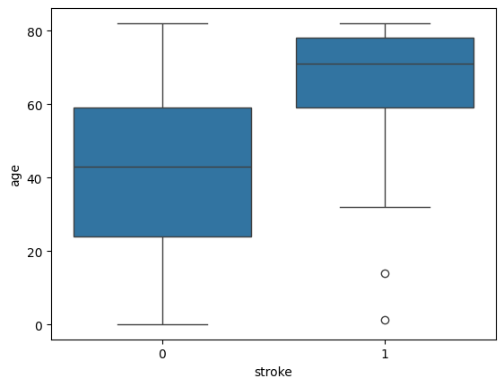
:::

-\> Insight: Stroke risk tends to increase with age, so older
individuals may dominate the stroke = 1 category.
:::

### Hypertension and Heart Disease
:::

-   Compare the prevalence of hypertension (hypertension = 1) and heart
    disease (heart_disease = 1) in the stroke and non-stroke groups:

``` python
hypertension_by_stroke = stroke_data.groupby('stroke')['hypertension'].mean()
heart_disease_by_stroke = stroke_data.groupby('stroke')['heart_disease'].mean()
print(hypertension_by_stroke, heart_disease_by_stroke)
```

::: {.output .stream .stdout}
    stroke
    0    0.088871
    1    0.265060
    Name: hypertension, dtype: float64 stroke
    0    0.047110
    1    0.188755
    Name: heart_disease, dtype: float64
:::

-\> Insight: People with hypertension or heart disease may have a higher
risk of stroke.
:::

::: {.cell .markdown}
### BMI and Glucose Levels
:::

::: {.cell .code execution_count="15"}
``` python
sns.boxplot(data=stroke_data, x='stroke', y='bmi')
sns.boxplot(data=stroke_data, x='stroke', y='avg_glucose_level')
```

::: {.output .execute_result execution_count="15"}
    <Axes: xlabel='stroke', ylabel='bmi'>
:::

::: {.output .display_data}
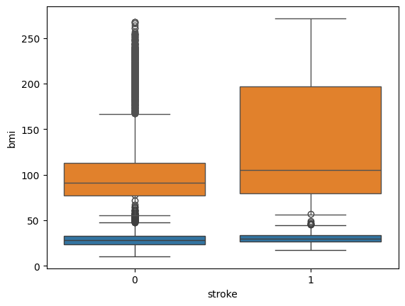
:::
:::

::: {.cell .markdown}
### Smoking Status with Stroke
:::

``` python
sns.countplot(data=stroke_data, x='smoking_status', hue='stroke')
```

::: {.output .execute_result execution_count="16"}
    <Axes: xlabel='smoking_status', ylabel='count'>
:::

::: {.output .display_data}
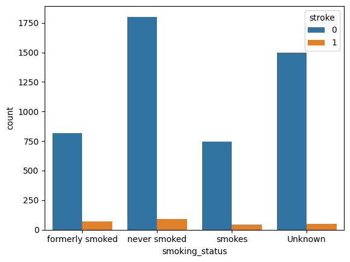
:::
:::

-\> Smoking doesn\'t cause higher stroke rate
:::

### Work Type and Residence
:::

``` python
sns.countplot(data=stroke_data, x='work_type', hue='stroke')
sns.countplot(data=stroke_data, x='Residence_type', hue='stroke')
```

    <Axes: xlabel='work_type', ylabel='count'>
:::

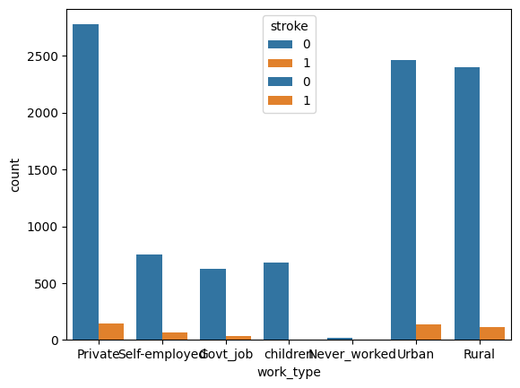
:::

::: {.cell .markdown}
### Marriage and Stroke Risk
:::

``` python
sns.countplot(data=stroke_data, x='ever_married', hue='stroke')
```

::: {.output .execute_result execution_count="18"}
    <Axes: xlabel='ever_married', ylabel='count'>
:::

::: {.output .display_data}
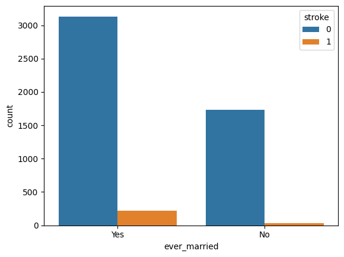
:::
:::

## 2.2. Multivariate Insights {#22-multivariate-insights}
:::

### \'age\', \'avg_glucose_level\', \'bmi\'
:::

::: {.cell .code execution_count="19"}
``` python
sns.pairplot(data=stroke_data, hue='stroke', vars=['age', 'avg_glucose_level', 'bmi'])
```

::: {.output .execute_result execution_count="19"}
    <seaborn.axisgrid.PairGrid at 0x13f856cacc0>
:::

::: {.output .display_data}
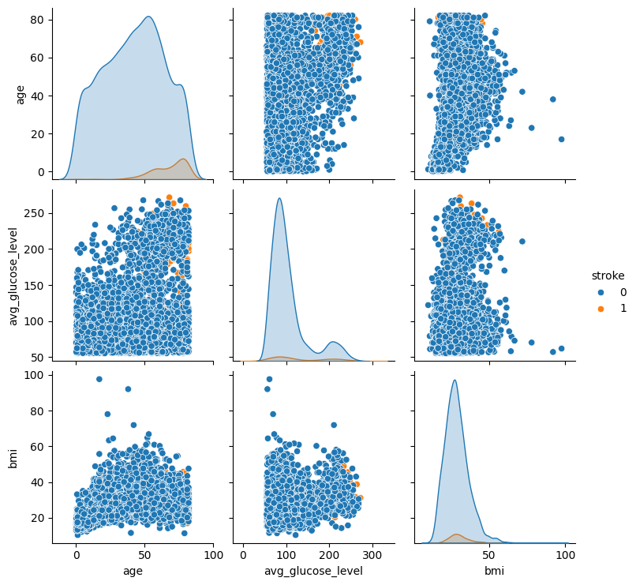
:::
:::

::: {.cell .markdown}
-\> Insight: Older individuals with high glucose and BMI may exhibit
compounding stroke risks.
:::

::: {.cell .markdown}
### Outliers and Anomalies
:::

::: {.cell .code execution_count="20"}
``` python
sns.boxplot(data=stroke_data[['age', 'bmi', 'avg_glucose_level']])
```

::: {.output .execute_result execution_count="20"}
    <Axes: >
:::

::: {.output .display_data}
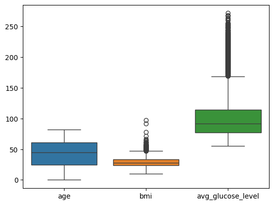
:::
:::

::: {.cell .markdown}
## 2.2. Exercises {#22-exercises}
:::

::: {.cell .markdown}
### Exercise 1 {#exercise-1}
:::

::: {.cell .markdown}
### Exercise 2 {#exercise-2}
:::

::: {.cell .markdown id="JTHqRN7aLTqY"}
# 3. Exploratory Data Analysis {#3-exploratory-data-analysis}
:::

::: {.cell .markdown}
## 3.1. Basic concepts {#31-basic-concepts}

Before we start, let\'s revise some concepts related to distributions:

-   What is a distribution?
    -   a distribution describes how the values of a variable are spread
        or arranged.
    -   it provides insights into the frequency or probability of
        occurrence of different values in a dataset.
-   What is the range of a distribution?
    -   difference between the maximum and minimum values
-   What are quartiles and inter-quartile range?
    -   quartiles are values that divide a dataset into four equal parts
        after sorting the data in ascending order.
        -   Q1 (First Quartile): The 25th percentile. It marks the value
            below which 25% of the data falls.
        -   Q2 (Second Quartile): The 50th percentile, also known as the
            median. It divides the dataset into two equal halves.
        -   Q3 (Third Quartile): The 75th percentile. It marks the value
            below which 75% of the data falls.
    -   The interquartile range (IQR) measures the spread of the middle
        50% of the data. It is calculated as: IQR=Q3−Q1
-   What are mean, mode, median values?
    -   mean: average value
    -   median: middle value when data is sorted
    -   mode: most frequent values
:::

::: {.cell .markdown id="Bo6IhWeGOHGq"}
## 3.2. Check for missing values {#32-check-for-missing-values}

Why? Missing values is number one problem with a dataset because it
affects almost every aspect of your downstream analysis. For example:

1.  Missing values can affect all your descriptive statistics (think
    about how missing values can affect the \"mode\" of a column)
2.  Missing values would also affect the quality (generalization) of
    predictive models
:::

::: {.cell .code execution_count="21" colab="{\"base_uri\":\"https://localhost:8080/\",\"height\":460}" executionInfo="{\"elapsed\":429,\"status\":\"ok\",\"timestamp\":1731731704900,\"user\":{\"displayName\":\"Gia Ngo\",\"userId\":\"10487874870828670874\"},\"user_tz\":-420}" id="Dewpd-F3bae3" outputId="d6aedbbf-0088-44fd-c53a-c095e13045df"}
``` python
stroke_data.isnull().sum()
```

::: {.output .execute_result execution_count="21"}
    id                     0
    gender                 0
    age                    0
    hypertension           0
    heart_disease          0
    ever_married           0
    work_type              0
    Residence_type         0
    avg_glucose_level      0
    bmi                  201
    smoking_status         0
    stroke                 0
    dtype: int64
:::
:::

::: {.cell .markdown id="0-0obp0jRwgw"}
Only \"bmi\" has some missing values. Let\'s see the percentage of
missing values for \"bmi\"
:::

::: {.cell .code execution_count="22" colab="{\"base_uri\":\"https://localhost:8080/\"}" executionInfo="{\"elapsed\":409,\"status\":\"ok\",\"timestamp\":1731731733316,\"user\":{\"displayName\":\"Gia Ngo\",\"userId\":\"10487874870828670874\"},\"user_tz\":-420}" id="jJKmc2wQbf2g" outputId="baeb55e5-62bd-40a0-e3fb-472a59144de2"}
``` python
# Ratio of missing null values
# (number of missing BMI values ) / (number of rows)
(stroke_data["bmi"].isnull().sum()/stroke_data.shape[0]) * 100
```

::: {.output .execute_result execution_count="22"}
    3.9334637964774952
:::
:::

::: {.cell .markdown id="rutOIgjgJpZV"}
Ratio of missing values of bmi is 3.93%
:::

::: {.cell .markdown id="vgdtSvkYXbyV"}
Optional: create a new dataframe with missing value counts to plot.
There are other ways to visualize this statistics, this is just to
practice dataframe manipulation)
:::

::: {.cell .code execution_count="23" id="uZ16Pn30VEU0"}
``` python
missing_data_count = {'Missing': [stroke_data["bmi"].isnull().sum()], 'Not Missing': [stroke_data["bmi"].notnull().sum()]}
missing_bmi = pd.DataFrame(data=missing_data_count)
```
:::

::: {.cell .code execution_count="24" colab="{\"base_uri\":\"https://localhost:8080/\",\"height\":89}" executionInfo="{\"elapsed\":444,\"status\":\"ok\",\"timestamp\":1731731802050,\"user\":{\"displayName\":\"Gia Ngo\",\"userId\":\"10487874870828670874\"},\"user_tz\":-420}" id="i_vPrglGJ__t" outputId="37e72366-f244-4415-dd2a-3e57158298b9"}
``` python
missing_bmi
```

::: {.output .execute_result execution_count="24"}
```{=html}
<div>
<style scoped>
    .dataframe tbody tr th:only-of-type {
        vertical-align: middle;
    }

    .dataframe tbody tr th {
        vertical-align: top;
    }

    .dataframe thead th {
        text-align: right;
    }
</style>
<table border="1" class="dataframe">
  <thead>
    <tr style="text-align: right;">
      <th></th>
      <th>Missing</th>
      <th>Not Missing</th>
    </tr>
  </thead>
  <tbody>
    <tr>
      <th>0</th>
      <td>201</td>
      <td>4909</td>
    </tr>
  </tbody>
</table>
</div>
```
:::
:::

::: {.cell .code execution_count="25" colab="{\"base_uri\":\"https://localhost:8080/\",\"height\":447}" executionInfo="{\"elapsed\":419,\"status\":\"ok\",\"timestamp\":1731731845241,\"user\":{\"displayName\":\"Gia Ngo\",\"userId\":\"10487874870828670874\"},\"user_tz\":-420}" id="K27G5dEdJi0E" outputId="135b3482-0849-4c86-d5f5-852a746e0c63"}
``` python
# Plotting the missing values
sns.barplot(data=missing_bmi , palette="rocket")
```

::: {.output .execute_result execution_count="25"}
    <Axes: >
:::

::: {.output .display_data}
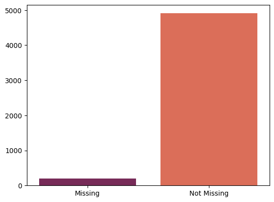
:::
:::

::: {.cell .markdown id="8yIyENAxXvKR"}
### 3.2.1. Categorical and Numerical Variables {#321-categorical-and-numerical-variables}

col_names() - This a function created to get the columns names that has
categorical and numerical data separately
:::

::: {.cell .code execution_count="26" id="pahj28TPTFDd"}
``` python
def col_names(df):
    # Get categorical Variables
    cat_cols = [col for col in df.columns if df[col].dtypes not in ["int64", "float64"]]
    # Get numerical Variables
    num_cols = [col for col in df.columns if df[col].dtypes in ["int64", "float64"]]
    # Get Numerical but Categorical Variables
    num_but_cat = [col for col in num_cols if df[col].nunique() < 10]
    # Adding num_but_cat to cat_cols
    cat_cols = num_but_cat + cat_cols
    # num_but_cat removing from num_cols
    num_cols = [col for col in num_cols if col not in num_but_cat]
    print(f"Numerical Cols: {num_cols} \nCategorical Cols: {cat_cols} \nNumerical but Categorical: {num_but_cat}")
    return num_cols, cat_cols
```
:::

::: {.cell .code execution_count="27" colab="{\"base_uri\":\"https://localhost:8080/\"}" executionInfo="{\"elapsed\":3,\"status\":\"ok\",\"timestamp\":1731731868436,\"user\":{\"displayName\":\"Gia Ngo\",\"userId\":\"10487874870828670874\"},\"user_tz\":-420}" id="HM94san4YqXs" outputId="8a8595ae-1995-42c3-b087-a537cc04c6fe"}
``` python
numerical_cols, categorical_cols = col_names(stroke_data)
```

::: {.output .stream .stdout}
    Numerical Cols: ['id', 'age', 'avg_glucose_level', 'bmi'] 
    Categorical Cols: ['hypertension', 'heart_disease', 'stroke', 'gender', 'ever_married', 'work_type', 'Residence_type', 'smoking_status'] 
    Numerical but Categorical: ['hypertension', 'heart_disease', 'stroke']
:::
:::

::: {.cell .code execution_count="28"}
``` python
stroke_data["hypertension"].value_counts()
```

::: {.output .execute_result execution_count="28"}
    hypertension
    0    4612
    1     498
    Name: count, dtype: int64
:::
:::

::: {.cell .markdown id="nTE4kUcUaw_D"}
### 3.2.2. Analysing Numerical Attributes {#322-analysing-numerical-attributes}
:::

::: {.cell .code execution_count="29" colab="{\"base_uri\":\"https://localhost:8080/\",\"height\":175}" executionInfo="{\"elapsed\":447,\"status\":\"ok\",\"timestamp\":1731731936290,\"user\":{\"displayName\":\"Gia Ngo\",\"userId\":\"10487874870828670874\"},\"user_tz\":-420}" id="Joi6D7OGbBjY" outputId="67e4900c-ab63-4903-d4be-6f4d6c135b17"}
``` python
# what are the columns of table below
stroke_data[numerical_cols].describe().T
```

::: {.output .execute_result execution_count="29"}
```{=html}
<div>
<style scoped>
    .dataframe tbody tr th:only-of-type {
        vertical-align: middle;
    }

    .dataframe tbody tr th {
        vertical-align: top;
    }

    .dataframe thead th {
        text-align: right;
    }
</style>
<table border="1" class="dataframe">
  <thead>
    <tr style="text-align: right;">
      <th></th>
      <th>count</th>
      <th>mean</th>
      <th>std</th>
      <th>min</th>
      <th>25%</th>
      <th>50%</th>
      <th>75%</th>
      <th>max</th>
    </tr>
  </thead>
  <tbody>
    <tr>
      <th>id</th>
      <td>5110.0</td>
      <td>36517.829354</td>
      <td>21161.721625</td>
      <td>67.00</td>
      <td>17741.250</td>
      <td>36932.000</td>
      <td>54682.00</td>
      <td>72940.00</td>
    </tr>
    <tr>
      <th>age</th>
      <td>5110.0</td>
      <td>43.226614</td>
      <td>22.612647</td>
      <td>0.08</td>
      <td>25.000</td>
      <td>45.000</td>
      <td>61.00</td>
      <td>82.00</td>
    </tr>
    <tr>
      <th>avg_glucose_level</th>
      <td>5110.0</td>
      <td>106.147677</td>
      <td>45.283560</td>
      <td>55.12</td>
      <td>77.245</td>
      <td>91.885</td>
      <td>114.09</td>
      <td>271.74</td>
    </tr>
    <tr>
      <th>bmi</th>
      <td>4909.0</td>
      <td>28.893237</td>
      <td>7.854067</td>
      <td>10.30</td>
      <td>23.500</td>
      <td>28.100</td>
      <td>33.10</td>
      <td>97.60</td>
    </tr>
  </tbody>
</table>
</div>
```
:::
:::

::: {.cell .code execution_count="30" colab="{\"base_uri\":\"https://localhost:8080/\",\"height\":466}" executionInfo="{\"elapsed\":731,\"status\":\"ok\",\"timestamp\":1731735352071,\"user\":{\"displayName\":\"Gia Ngo\",\"userId\":\"10487874870828670874\"},\"user_tz\":-420}" id="Cu4bkAWpbQUi" outputId="2c6ea83a-0723-45d3-bdae-823197ebba07"}
``` python
# Visualize each attribute
sns.histplot(x=stroke_data["age"], data=stroke_data, color="teal")

plt.title("Distribution of Age in Stroke Data")
plt.xlabel("Age")
plt.ylabel("Frequency")

plt.show()
```

::: {.output .display_data}
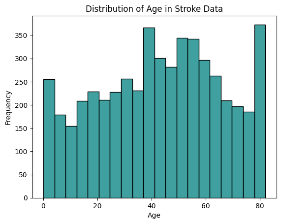
:::
:::

::: {.cell .markdown}
**Comment**

-   Range: the data spans from 0 to approximately 80 years. This
    suggests the dataset covers a wide age range, including both
    children and older adults.
-   Peak Frequency: the highest frequency is observed in the age group
    of around 80, followed by individuals in their 40s and 60s. This may
    indicate a significant representation of elderly individuals and
    middle-aged groups in the dataset.
-   A somewhat bimodal-like behavior is present, with peaks around 40
    and 80
:::

::: {.cell .markdown}
### 3.2.3. Exercises {#323-exercises}

**Exercises:**

-   Can you plot the histograms of other numerical columns?
-   Can you show the plots of \"age\", \"avg_glucose_level\", \"bmi\"
    side by side, i.e. 3 plots on the same row?
-   Can you show customize the axes of the plots to show \"Age\" ,
    \"Average Gluscose Level\", \"BMI\" on the x-axes?
-   References:
    -   <https://seaborn.pydata.org/generated/seaborn.histplot.html>
    -   <https://www.w3schools.com/python/matplotlib_histograms.asp>
:::

::: {.cell .markdown}
`<span style="color: yellow; font-weight: bold;">`{=html}Exercises:`</span>`{=html}

-   Can you plot the histograms of other numerical columns?
-   Can you show the box plots of \"age\", \"avg_glucose_level\",
    \"bmi\" side by side, i.e. 3 plots on the same row, each plot is
    vertically-oriented instead of the default horizontal orientation
-   References:
    -   <https://seaborn.pydata.org/generated/seaborn.boxplot.html>
    -   <https://www.geeksforgeeks.org/box-plot-in-python-using-matplotlib/>
:::

::: {.cell .markdown}
#### Histogram of numerical columns
:::

::: {.cell .markdown}
-   avg_glucose_level
:::

::: {.cell .code execution_count="31"}
``` python
sns.histplot(x=stroke_data["avg_glucose_level"], data=stroke_data, color="teal")

plt.title("Distribution of Average Glucose Level in Stroke Data")
plt.xlabel("avg_glucose_level")
plt.ylabel("Frequency")

plt.show()
```

::: {.output .display_data}
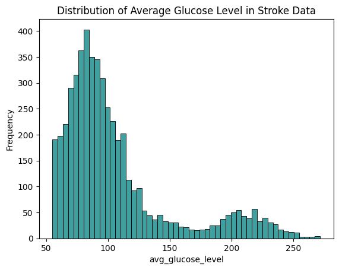
:::
:::

::: {.cell .markdown}
-   bmi
:::

::: {.cell .code execution_count="32"}
``` python
sns.histplot(x=stroke_data["bmi"], data=stroke_data, color="teal")

plt.title("Distribution of BMI in Stroke Data")
plt.xlabel("bmi")
plt.ylabel("Frequency")

plt.show()
```

::: {.output .display_data}
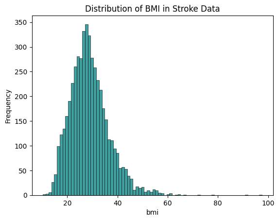
:::
:::

::: {.cell .markdown id="J23DHJ47ZEvG"}
## 3.3. Outliers {#33-outliers}

Outliers are another \"defect\" in the data that need \"correction\":

-   Outliers can significantly affect some statistics of a distribution,
    which can affect both your interpretations + how you fix missing
    data. Can you figure out why is that so?
-   Outliers can significantly affect predictive models. Can you figure
    out why it is so?
:::

::: {.cell .markdown}
### 3.3.1. Check for outliers {#331-check-for-outliers}
:::

::: {.cell .markdown}
-   Checking for outliers of \"BMI\"
:::

::: {.cell .code execution_count="33" colab="{\"base_uri\":\"https://localhost:8080/\",\"height\":466}" executionInfo="{\"elapsed\":607,\"status\":\"ok\",\"timestamp\":1731735345273,\"user\":{\"displayName\":\"Gia Ngo\",\"userId\":\"10487874870828670874\"},\"user_tz\":-420}" id="8nZbuuh8dY4W" outputId="4acd5328-52ef-45de-c47e-5d06c62d143b"}
``` python
sns.boxplot(x=stroke_data["bmi"], data=stroke_data, color="indianred")
```

::: {.output .execute_result execution_count="33"}
    <Axes: xlabel='bmi'>
:::

::: {.output .display_data}
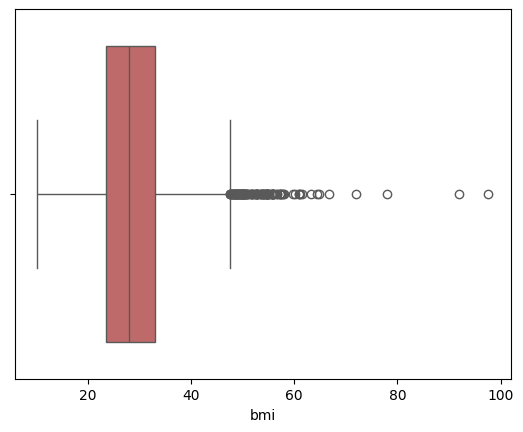
:::
:::

::: {.cell .markdown id="w84lSQzTeJF7"}
-   What do the box, \"whiskers\", and dots indicate?
    -   The box spans from the first quartile (Q1) to the third quartile
        (Q3). The line inside the box represents the median.
    -   The lines extending from the box are the whiskers, showing the
        range of the data.
    -   Points beyond the whiskers are marked as individual dots and
        represent unusual observations (outliers) that deviate
        significantly from the rest of the data.
:::

::: {.cell .markdown id="dECAIwMOk19X"}
### 3.3.2. \[Extra\] Checking for Outliers in Numerical Attributes {#332-extra-checking-for-outliers-in-numerical-attributes}

IQR (Interqartile range) is being used to check for outliers. There are
other methods to do this, this snippet is mainly to practice the concept
of functions in Python.

check_outliers() - This function will return the columns with outliers
:::

::: {.cell .code execution_count="34" id="8ewMjmc1k0m1"}
``` python
def check_outliers(df, numerical_cols, iqr=1.5, low_threshold=0.1, up_threshold=0.9):
    outlier_cols = []
    for col in numerical_cols:
        q1 = df[col].quantile(low_threshold)
        q3 = df[col].quantile(up_threshold)
        interquantile = q3 - q1
        up_limit = q3 + iqr * interquantile
        low_limit = q1 - iqr * interquantile
        if df[(df[col] > up_limit) | (df[col] < low_limit)].any(axis=None):
            outlier_cols.append(col)
    if not outlier_cols:
        print("There is no outliers")
    return outlier_cols
```
:::

::: {.cell .code execution_count="35" colab="{\"base_uri\":\"https://localhost:8080/\"}" executionInfo="{\"elapsed\":389,\"status\":\"ok\",\"timestamp\":1731735790292,\"user\":{\"displayName\":\"Gia Ngo\",\"userId\":\"10487874870828670874\"},\"user_tz\":-420}" id="G5WsFALclg0u" outputId="06ac6c96-4a2b-4567-b2f1-bea57c7a5499"}
``` python
outlier_cols = check_outliers(stroke_data, ['age'])
```

::: {.output .stream .stdout}
    There is no outliers
:::
:::

::: {.cell .markdown id="F_Vz_dEHf4qD"}
`<span style="color: yellow; font-weight: bold;">`{=html}Exercises:`</span>`{=html}
Can you update the function call above to check for outliers for all
numerical columns?
:::

::: {.cell .code execution_count="36"}
``` python
outlier_cols = check_outliers(stroke_data, numerical_cols)
outlier_cols
```

::: {.output .execute_result execution_count="36"}
    ['bmi']
:::
:::

::: {.cell .markdown id="TNwJnWied7Ai"}
### 3.3.3. Analysing Categorical Attributes {#333-analysing-categorical-attributes}
:::

::: {.cell .markdown}
-   Visualize the count of each unique category in the \'work_type\'
    column
:::

::: {.cell .code execution_count="37" colab="{\"base_uri\":\"https://localhost:8080/\",\"height\":469}" executionInfo="{\"elapsed\":592,\"status\":\"ok\",\"timestamp\":1731736154888,\"user\":{\"displayName\":\"Gia Ngo\",\"userId\":\"10487874870828670874\"},\"user_tz\":-420}" id="4JOqdU-_d6jJ" outputId="809554f7-2bdf-46b4-a2b0-b3ffd2e56fa8"}
``` python
sns.barplot(x = stroke_data["work_type"].unique(), y = stroke_data["work_type"].value_counts(), palette="rocket").set(title="work_type")
```

::: {.output .execute_result execution_count="37"}
    [Text(0.5, 1.0, 'work_type')]
:::

::: {.output .display_data}
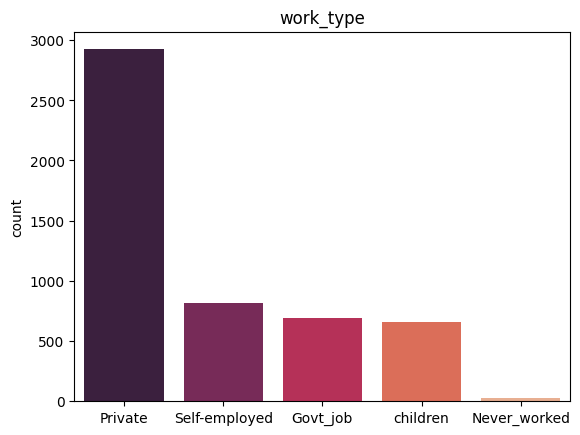
:::
:::

::: {.cell .markdown id="AytA3rkuiIs6"}
### 3.3.4. Analysing Target Variable {#334-analysing-target-variable}
:::

::: {.cell .markdown}
-   Visualize the count of each unique category in the \'stroke\' column
:::

::: {.cell .code execution_count="38" colab="{\"base_uri\":\"https://localhost:8080/\",\"height\":469}" executionInfo="{\"elapsed\":423,\"status\":\"ok\",\"timestamp\":1731736702266,\"user\":{\"displayName\":\"Gia Ngo\",\"userId\":\"10487874870828670874\"},\"user_tz\":-420}" id="ynmBOeS7iIHt" outputId="002d3f0f-babd-496f-acc6-9352a618dc2d"}
``` python
# Get stroke counts and plot
stroke_data["stroke"].value_counts()
sns.barplot(x = stroke_data["stroke"].unique(), y = stroke_data["stroke"].value_counts(), palette="viridis").set(title="Stroke")
```

::: {.output .execute_result execution_count="38"}
    [Text(0.5, 1.0, 'Stroke')]
:::

::: {.output .display_data}
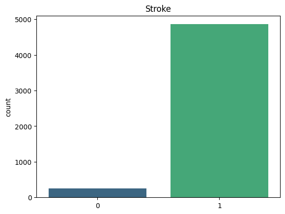
:::
:::

::: {.cell .code execution_count="39" colab="{\"base_uri\":\"https://localhost:8080/\",\"height\":475}" executionInfo="{\"elapsed\":482,\"status\":\"ok\",\"timestamp\":1731736715235,\"user\":{\"displayName\":\"Gia Ngo\",\"userId\":\"10487874870828670874\"},\"user_tz\":-420}" id="Tuu5th7jiWpI" outputId="7b9a9bbe-cb07-44c7-b0ac-e40ac2612662"}
``` python
# Plot as percentage
plt.pie(stroke_data["stroke"].value_counts(), labels=[1,0], colors=["indianred", "mistyrose"])
```

::: {.output .execute_result execution_count="39"}
    ([<matplotlib.patches.Wedge at 0x13f89044170>,
      <matplotlib.patches.Wedge at 0x13f88fa9970>],
     [Text(-1.0871361453364168, 0.16773491438301516, '1'),
      Text(1.087136143373357, -0.1677349271061446, '0')])
:::

::: {.output .display_data}
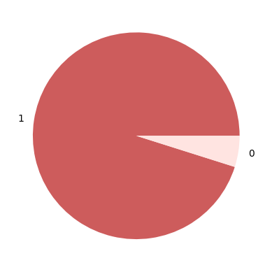
:::
:::

::: {.cell .markdown id="WGZDHV8wkllx"}
Ratio of 1s is 95.1%
:::

::: {.cell .markdown}
**-\> skewed dataset**
:::

::: {.cell .markdown}
#### 3.3.4.1. Exercises {#3341-exercises}
:::

::: {.cell .markdown id="KSfODNa4jg_Q"}
`<span style="color: yellow; font-weight: bold;">`{=html}Exercises:`</span>`{=html}

-   Can you update the labels to \"Stroke\" and \"No stroke\" instead of
    \"0\" and \"1\"?
-   Can you comment on the distribution of \"Stroke\" vs \"No stroke\"
    labels, how would this affect your predictive model?
:::

::: {.cell .code execution_count="42"}
``` python
# Plot as percentage
plt.pie(stroke_data["stroke"].value_counts(), labels=["Stroke", "No stroke"], colors=["indianred", "mistyrose"])
```

::: {.output .execute_result execution_count="42"}
    ([<matplotlib.patches.Wedge at 0x13f89644fb0>,
      <matplotlib.patches.Wedge at 0x13f895f7320>],
     [Text(-1.0871361453364168, 0.16773491438301516, 'Stroke'),
      Text(1.087136143373357, -0.1677349271061446, 'No stroke')])
:::

::: {.output .display_data}
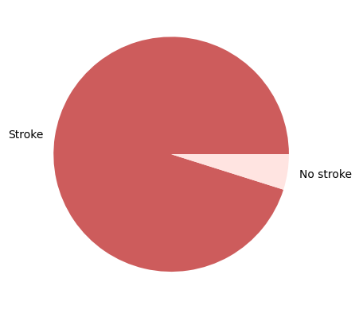
:::
:::

::: {.cell .markdown id="YSyx2JwApgMs"}
# 4. More advanced analytics {#4-more-advanced-analytics}

Often time, the intention of (3) Exploratory Data Analytics is to help
you better shape your (2) Formulate Data Questions (Hypothesis). What we
are looking for in this step is often the relationship between
variables, more specifically the relationship between predictors
(indepdendent variables) and the predicted (dependent variables).

-   More often than not, we can draw significant insights from this step
    without any sophisticated predictive modeling, especially when data
    is limited.
-   Even if you can use predictive modelling, these insights might be
    used to answer (to some extent) the questions of which factors are
    more influential in predicting certain variable, why these factors
    are more important etc. These questions are often more important
    (and more difficult) than being able to predict certain variables
    accurately.
:::

::: {.cell .markdown}
-   Comment: Có thể kiếm được các insights ngay từ bước xác định mqh
    giữa các features
:::

::: {.cell .markdown id="0X0YznqemmZy"}
## 4.1. Correlation between numerical columns {#41-correlation-between-numerical-columns}
:::

::: {.cell .code execution_count="40" colab="{\"base_uri\":\"https://localhost:8080/\",\"height\":452}" id="5si1wSZvmlDO" outputId="9af6dcd2-a9eb-4d8a-c2fd-5097cd9afc3d"}
``` python
sns.heatmap(stroke_data[numerical_cols].corr(), annot=True, linewidths=0.5,)
```

::: {.output .execute_result execution_count="40"}
    <Axes: >
:::

::: {.output .display_data}
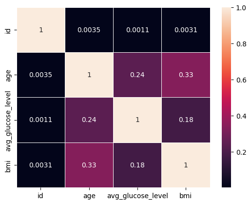
:::
:::

::: {.cell .markdown}
-   Comments:
    -   Most non-diagonal values indicate weak or no linear
        relationships among the variables
    -   \'age\' and \'bmi\' have a correlation of 0.33, suggesting a
        moderate positive relationship---older individuals may tend to
        have higher BMI.
:::

::: {.cell .markdown}
### 4.1.1. Exercises {#411-exercises}
:::

::: {.cell .markdown id="3qd5gBtJndEe"}
`<span style="color: yellow; font-weight: bold;">`{=html}Exercises:`</span>`{=html}

-   What is correlation coefficient? How is it computed and why it is
    important?
    -   correlation is a statistical measure that expresses the strength
        and direction of the relationship between two variables. It
        ranges from -1 to 1.
-   Why we only compute corellation coefficients between numerical
    variables?
    -   the concept of correlation measures the strength and direction
        of a linear relationship, which requires continuous or ordinal
        data where mathematical operations (like addition, subtraction,
        and averaging) are meaningful.
-   Why is it important (or may not be important) to consider
    correlation between varibles?
    -   it helps identify whether and how strongly variables are
        related. If a strong correlation exists, the value of one
        variable can be used to predict the other in linear regression
        models. See here
        <https://www.widsworldwide.org/get-inspired/blog/a-data-scientists-deep-dive-into-the-wids-datathon/>
:::

::: {.cell .markdown}
-   Pearson\'s correlation (r) - (linear relationship)
-   Mối tương quan tuyến tính
-   Correlation != causation e.g. drowning rate, ice-cream sold
:::

::: {.cell .markdown id="MUt1MSnFWqdQ"}
## 4.2. Target Variable vs Numerical Attributes {#42-target-variable-vs-numerical-attributes}
:::

::: {.cell .code execution_count="41" colab="{\"base_uri\":\"https://localhost:8080/\"}" id="dUOKPpaQq2jp" outputId="968e20f9-3bcc-4e40-a57c-9884fd588247"}
``` python
for col in numerical_cols:
    print(stroke_data.groupby("stroke").agg({col:"mean"}), end="\n\n")
```

::: {.output .stream .stdout}
                      id
    stroke              
    0       36487.236371
    1       37115.068273

                  age
    stroke           
    0       41.971545
    1       67.728193

            avg_glucose_level
    stroke                   
    0              104.795513
    1              132.544739

                  bmi
    stroke           
    0       28.823064
    1       30.471292
:::
:::

::: {.cell .markdown}
### 4.2.1. Excercises {#421-excercises}
:::

::: {.cell .markdown id="MG4R3MHwrA7X"}
`<span style="color: yellow; font-weight: bold;">`{=html}Exercises:`</span>`{=html}

-   Can you visualize these results?
-   What interpretation can you draw from these results?
:::

::: {.cell .code execution_count="47"}
``` python
# Iterate through each numerical column to plot the mean values
for col in numerical_cols:
    if col != 'id':
        grouped_means = stroke_data.groupby("stroke").agg({col:"mean"})
        plt.figure(figsize=(8, 6))
        grouped_means[col].plot(kind='bar', color='orange', title=f"Mean of {col} by Stroke")
        plt.xlabel("Stroke (0 = No, 1 = Yes)")
        plt.ylabel(f"Mean {col}")
        plt.xticks(rotation=0)  # Keep x-axis labels horizontal
        plt.grid(axis='y', linestyle='--', alpha=0.7)
        plt.show()
```

::: {.output .display_data}
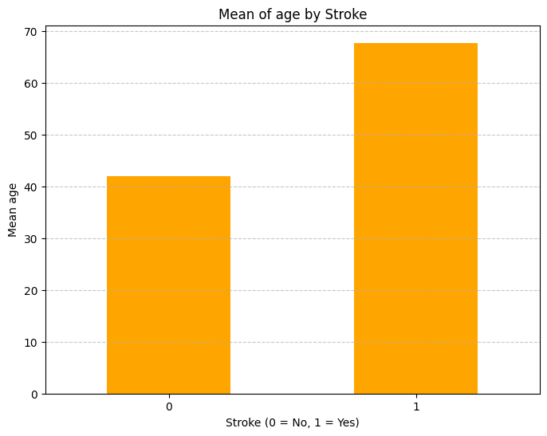
:::

::: {.output .display_data}
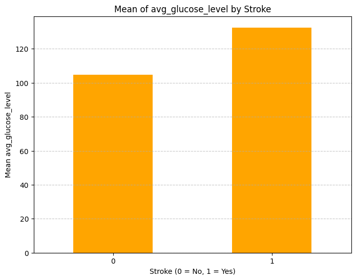
:::

::: {.output .display_data}
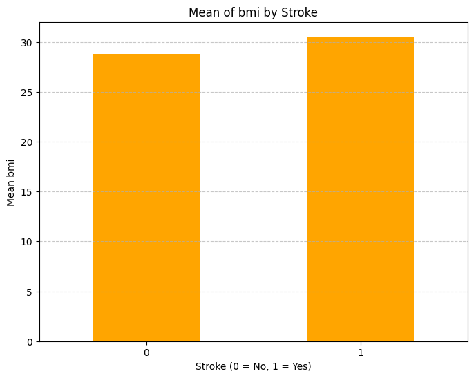
:::
:::

::: {.cell .markdown}
-   Comments:
    -   The mean age for individuals who have experienced a stroke is
        significantly higher than for those who haven\'t.
    -   Individuals who had a stroke have a higher average glucose level
        compared to those who didn\'t
    -   The mean bmi of both stroke and no_stroke doesn\'t have much
        differences
:::

::: {.cell .markdown id="M-9l1NpbXJnn"}
## 4.3. Target Variable vs Categorical Attributes {#43-target-variable-vs-categorical-attributes}
:::

::: {.cell .markdown}
### 4.3.1. Exercises {#431-exercises}
:::

::: {.cell .markdown id="2LtJ39EJr-20"}
`<span style="color: yellow; font-weight: bold;">`{=html}Exercises:`</span>`{=html}

-   Can you repeat the computation above for categorical columns?
-   Can you also plot the results?
-   What insights can you draw from the results?
:::

::: {.cell .markdown}
**Calculate proportions for categorical variables.**
:::

::: {.cell .code execution_count="52"}
``` python
for col in categorical_cols:
    # Calculate proportions of each category within stroke groups
    proportions = stroke_data.groupby(['stroke', col]).size().groupby(level=0).apply(lambda x: x / x.sum()).unstack()
    
    # Print the proportions
    print(f"Proportions for {col} grouped by Stroke:")
    print(proportions, end="\n\n")
```

::: {.output .stream .stdout}
    Proportions for hypertension grouped by Stroke:
    hypertension          0         1
    stroke stroke                    
    0      0       0.911129  0.088871
    1      1       0.734940  0.265060

    Proportions for heart_disease grouped by Stroke:
    heart_disease         0         1
    stroke stroke                    
    0      0       0.952890  0.047110
    1      1       0.811245  0.188755

    Proportions for stroke grouped by Stroke:
    stroke           0    1
    stroke stroke          
    0      0       1.0  NaN
    1      1       NaN  1.0

    Proportions for gender grouped by Stroke:
    gender           Female      Male     Other
    stroke stroke                              
    0      0       0.586916  0.412878  0.000206
    1      1       0.566265  0.433735       NaN

    Proportions for ever_married grouped by Stroke:
    ever_married         No       Yes
    stroke stroke                    
    0      0       0.355482  0.644518
    1      1       0.116466  0.883534

    Proportions for work_type grouped by Stroke:
    work_type      Govt_job  Never_worked   Private  Self-employed  children
    stroke stroke                                                           
    0      0       0.128369      0.004526  0.571076       0.155112  0.140918
    1      1       0.132530           NaN  0.598394       0.261044  0.008032

    Proportions for Residence_type grouped by Stroke:
    Residence_type     Rural     Urban
    stroke stroke                     
    0      0        0.493726  0.506274
    1      1        0.457831  0.542169

    Proportions for smoking_status grouped by Stroke:
    smoking_status   Unknown  formerly smoked  never smoked    smokes
    stroke stroke                                                    
    0      0        0.307961         0.167661      0.370706  0.153672
    1      1        0.188755         0.281124      0.361446  0.168675
:::
:::

::: {.cell .code execution_count="50"}
``` python
for col in categorical_cols:
    # Calculate counts of each category within stroke groups
    counts = stroke_data.groupby(['stroke', col]).size().unstack(fill_value=0)
    
    # Normalize the counts to get proportions
    proportions = counts.div(counts.sum(axis=1), axis=0)
    
    # Plot the proportions
    proportions.T.plot(kind='bar', figsize=(10, 6), stacked=True, title=f"Proportion of {col} by Stroke")
    plt.xlabel(col)
    plt.ylabel("Proportion")
    plt.legend(title="Stroke (0 = No, 1 = Yes)", loc="upper right")
    plt.grid(axis='y', linestyle='--', alpha=0.7)
    plt.xticks(rotation=0)
    plt.show()
```

::: {.output .display_data}
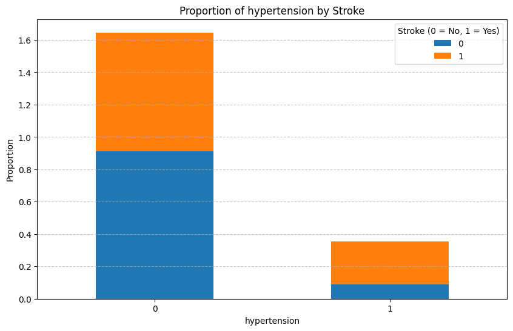
:::

::: {.output .display_data}
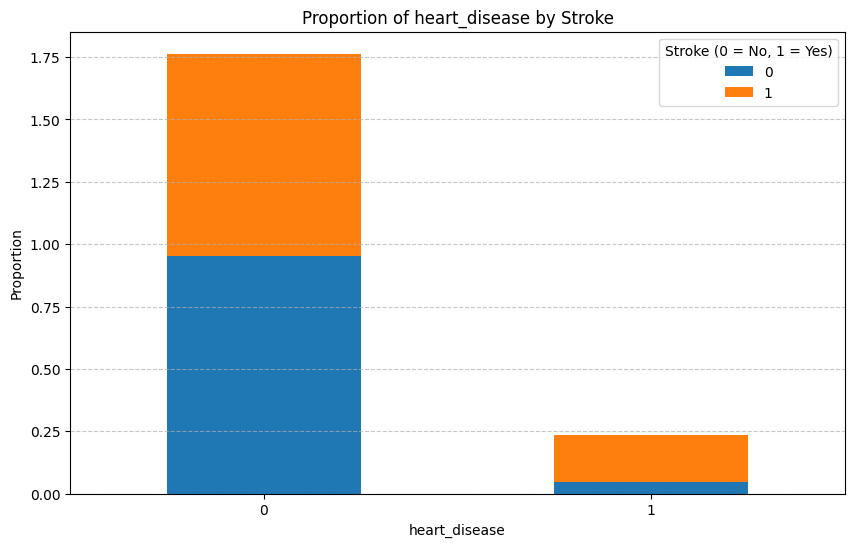
:::

::: {.output .display_data}
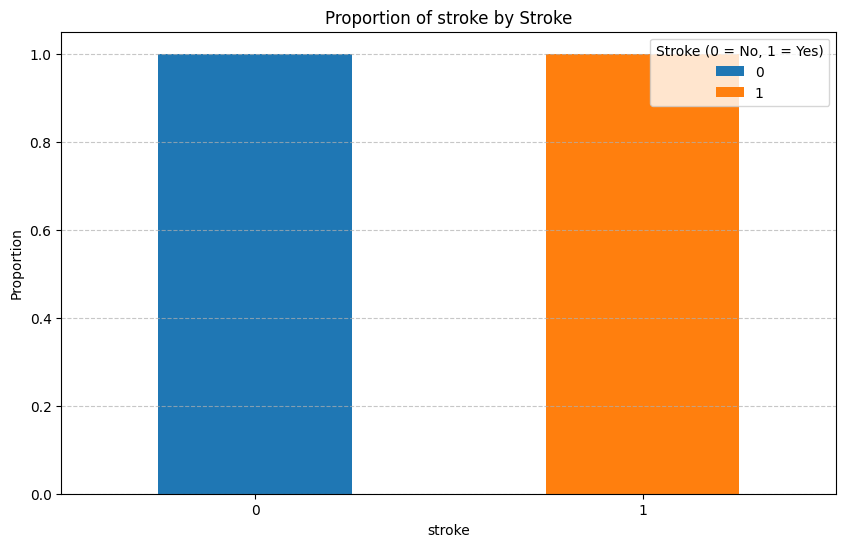
:::

::: {.output .display_data}
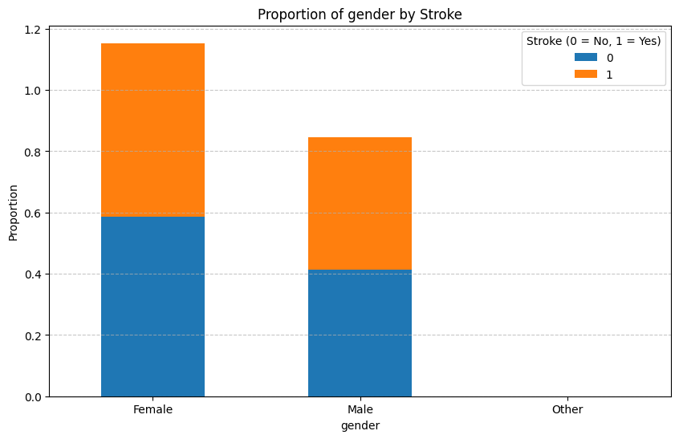
:::

::: {.output .display_data}
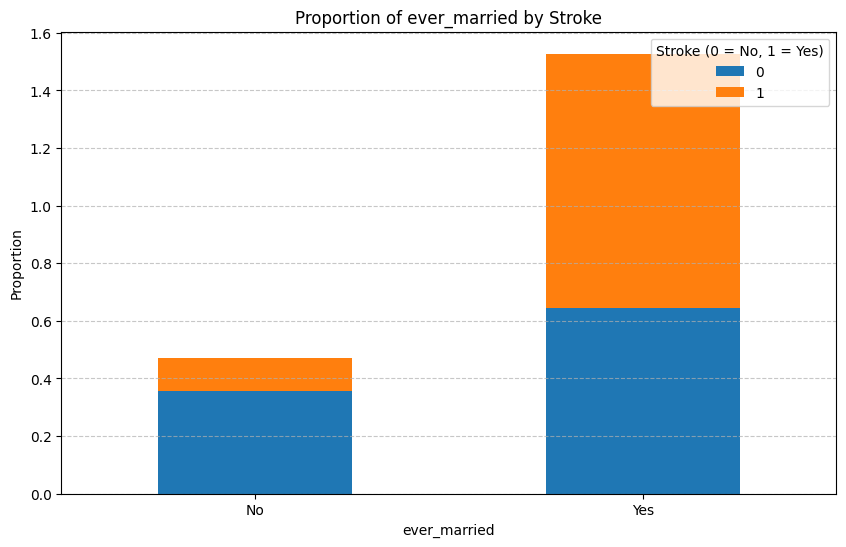
:::

::: {.output .display_data}
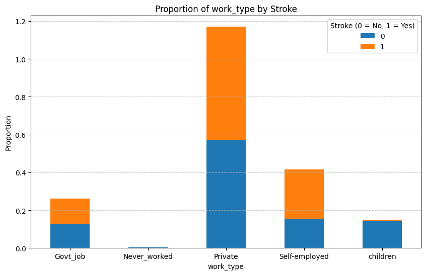
:::

::: {.output .display_data}
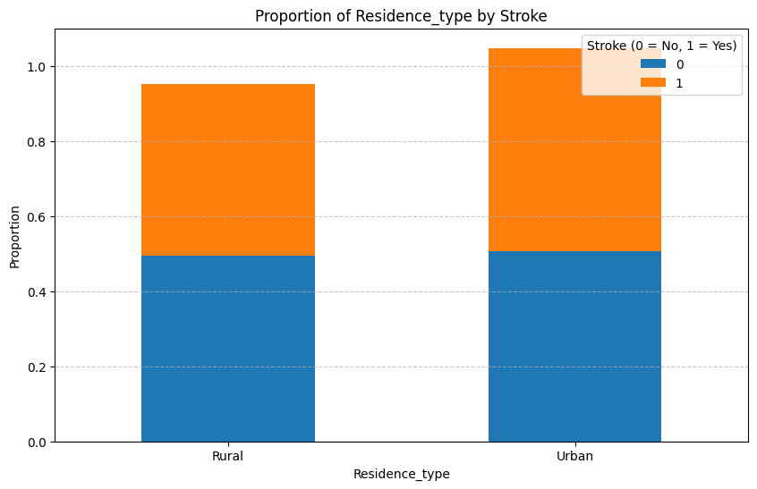
:::

::: {.output .display_data}
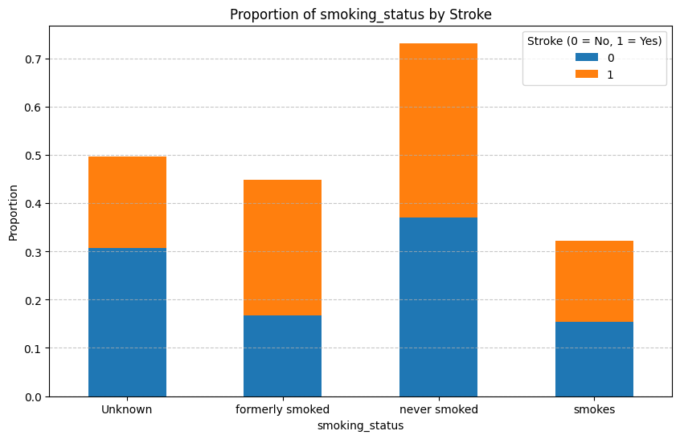
:::
:::

::: {.cell .markdown}
-   Interpretation
:::

::: {.cell .markdown id="8mbd7kLnZv3p"}
## Congratulations! You did it!

You have completed an Exploratory Data Analysis (EDA) on a real-life
dataset of patients with potential strokes. Your progress so far is
worth about one or two semesters of college classes, or a few thousand
dollars of data bootcamp :P. You can touch up your Jupyter notebook and
showcase your report in your online portfolio!

See you next week in our machine learning course!
:::

::: {.cell .markdown}
## Standard Scaler
:::

::: {.cell .code execution_count="54"}
``` python
from sklearn.preprocessing import StandardScaler
scaler = StandardScaler()
data_scaled = scaler.fit_transform(stroke_data)
```

::: {.output .error ename="ValueError" evalue="could not convert string to float: 'Male'"}
    ---------------------------------------------------------------------------
    ValueError                                Traceback (most recent call last)
    ~\AppData\Local\Temp\ipykernel_8440\3084276567.py in ?()
          1 from sklearn.preprocessing import StandardScaler
          2 scaler = StandardScaler()
    ----> 3 data_scaled = scaler.fit_transform(stroke_data)

    c:\Users\Admin\AppData\Local\Programs\Python\Python312\Lib\site-packages\sklearn\utils\_set_output.py in ?(self, X, *args, **kwargs)
        293     @wraps(f)
        294     def wrapped(self, X, *args, **kwargs):
    --> 295         data_to_wrap = f(self, X, *args, **kwargs)
        296         if isinstance(data_to_wrap, tuple):
        297             # only wrap the first output for cross decomposition
        298             return_tuple = (

    c:\Users\Admin\AppData\Local\Programs\Python\Python312\Lib\site-packages\sklearn\base.py in ?(self, X, y, **fit_params)
       1094                 )
       1095 
       1096         if y is None:
       1097             # fit method of arity 1 (unsupervised transformation)
    -> 1098             return self.fit(X, **fit_params).transform(X)
       1099         else:
       1100             # fit method of arity 2 (supervised transformation)
       1101             return self.fit(X, y, **fit_params).transform(X)

    c:\Users\Admin\AppData\Local\Programs\Python\Python312\Lib\site-packages\sklearn\preprocessing\_data.py in ?(self, X, y, sample_weight)
        872             Fitted scaler.
        873         """
        874         # Reset internal state before fitting
        875         self._reset()
    --> 876         return self.partial_fit(X, y, sample_weight)

    c:\Users\Admin\AppData\Local\Programs\Python\Python312\Lib\site-packages\sklearn\base.py in ?(estimator, *args, **kwargs)
       1470                 skip_parameter_validation=(
       1471                     prefer_skip_nested_validation or global_skip_validation
       1472                 )
       1473             ):
    -> 1474                 return fit_method(estimator, *args, **kwargs)

    c:\Users\Admin\AppData\Local\Programs\Python\Python312\Lib\site-packages\sklearn\preprocessing\_data.py in ?(self, X, y, sample_weight)
        908         self : object
        909             Fitted scaler.
        910         """
        911         first_call = not hasattr(self, "n_samples_seen_")
    --> 912         X = self._validate_data(
        913             X,
        914             accept_sparse=("csr", "csc"),
        915             dtype=FLOAT_DTYPES,

    c:\Users\Admin\AppData\Local\Programs\Python\Python312\Lib\site-packages\sklearn\base.py in ?(self, X, y, reset, validate_separately, cast_to_ndarray, **check_params)
        629                 out = y
        630             else:
        631                 out = X, y
        632         elif not no_val_X and no_val_y:
    --> 633             out = check_array(X, input_name="X", **check_params)
        634         elif no_val_X and not no_val_y:
        635             out = _check_y(y, **check_params)
        636         else:

    c:\Users\Admin\AppData\Local\Programs\Python\Python312\Lib\site-packages\sklearn\utils\validation.py in ?(array, accept_sparse, accept_large_sparse, dtype, order, copy, force_all_finite, ensure_2d, allow_nd, ensure_min_samples, ensure_min_features, estimator, input_name)
        994                         )
        995                     array = xp.astype(array, dtype, copy=False)
        996                 else:
        997                     array = _asarray_with_order(array, order=order, dtype=dtype, xp=xp)
    --> 998             except ComplexWarning as complex_warning:
        999                 raise ValueError(
       1000                     "Complex data not supported\n{}\n".format(array)
       1001                 ) from complex_warning

    c:\Users\Admin\AppData\Local\Programs\Python\Python312\Lib\site-packages\sklearn\utils\_array_api.py in ?(array, dtype, order, copy, xp)
        517         # Use NumPy API to support order
        518         if copy is True:
        519             array = numpy.array(array, order=order, dtype=dtype)
        520         else:
    --> 521             array = numpy.asarray(array, order=order, dtype=dtype)
        522 
        523         # At this point array is a NumPy ndarray. We convert it to an array
        524         # container that is consistent with the input's namespace.

    c:\Users\Admin\AppData\Local\Programs\Python\Python312\Lib\site-packages\pandas\core\generic.py in ?(self, dtype)
       2148     def __array__(self, dtype: npt.DTypeLike | None = None) -> np.ndarray:
       2149         values = self._values
    -> 2150         arr = np.asarray(values, dtype=dtype)
       2151         if (
       2152             astype_is_view(values.dtype, arr.dtype)
       2153             and using_copy_on_write()

    ValueError: could not convert string to float: 'Male'
:::
:::

::: {.cell .code}
``` python
```
:::
